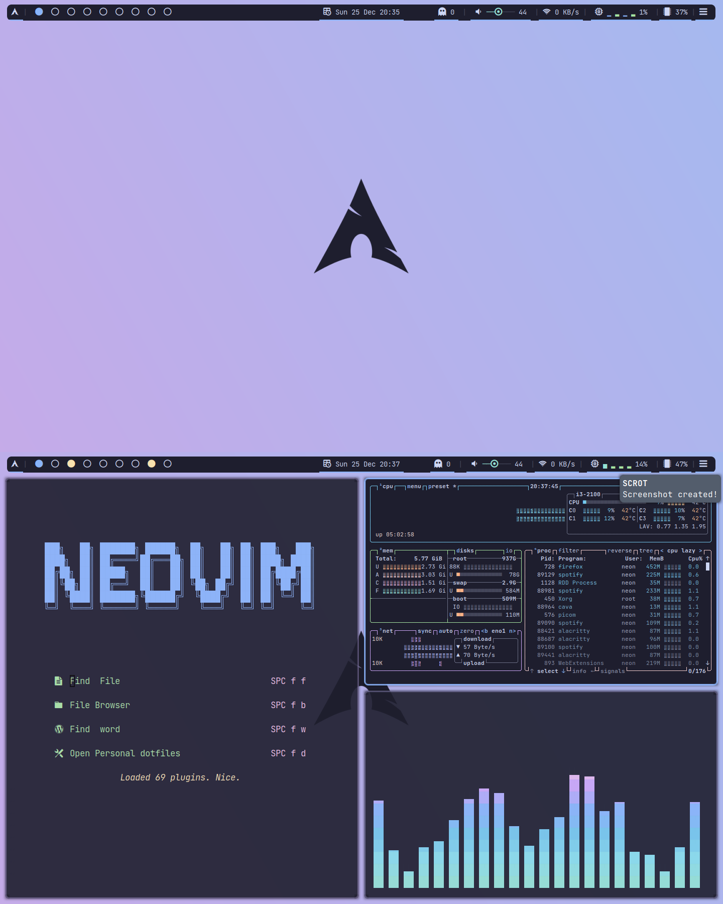

# 💻 Neon's Dotfiles

My configuration files for Arch Linux. Feel free to use the config *at your own risk*



## ⚙ Configurations

- [Alacritty](https://github.com/alacritty/alacritty)
- [Awesome](https://awesomewm.org)
- [Btop](https://github.com/aristocratos/btop)
- [Dmenu](https://tools.suckless.org/dmenu/)
- [Fish](https://fishshell.com)
- [ Neofetch ](https://github.com/dylanaraps/neofetch)
- [ Nitrogen ](https://wiki.archlinux.org/title/Nitrogen)
- [ Neovim ](https://neovim.io)
- [ Picom ](https://wiki.archlinux.org/title/Picom)
- [ Polybar ](https://github.com/polybar/polybar)
- [ Starship ](https://starship.rs/)
- [ Tmux ](https://github.com/tmux/tmux)

## 📁 Setup

Make sure you have [stow](https://www.gnu.org/software/stow/) installed. Then, simply run
```sh
git clone https://github.com/GoodBoyNeon/dotfiles
cd dotfiles/
stow .
```
**Disclamer:** The above command would OVERWRITE your current config. So make sure you got backups.

